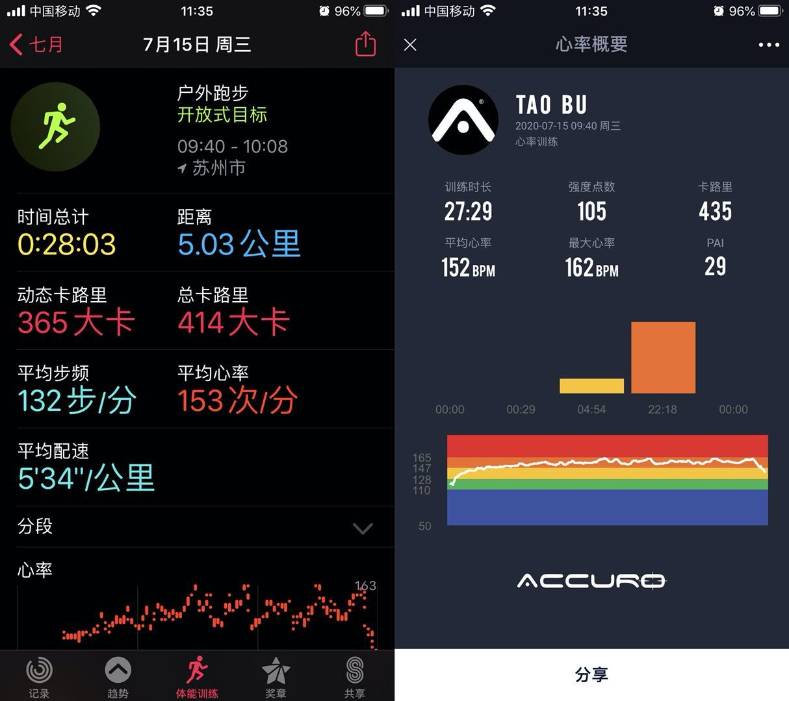
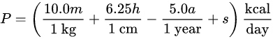

# 关于基础代谢

经过长时间 AccuroFit 与 AppleWatch 的对比测试，发现了俩个现象：

* AppleWatch 在运动过程中显示了总卡路里和动态卡路里，顾名思义总卡路里是指基础代谢与运动消耗的卡路里之和（见下面的卡路里对比图，动态卡路里 365kcal，总卡路里 414kcal）
* 基于我的个人信息计算，AccuroFit App 目前的卡路里计算结果比 AW 的动态卡路里仍然偏高 10% 左右（见下面的卡路里对比图，卡路里 435kcal）



## 个人信息
下面所有公式都是用我的个人信息代入计算，用到的字段包括：

* 年龄：33 周岁
* 体重：83 公斤
* 身高：183 公分
* 体脂率：19.9%


## 基础代谢的概念

查询 [Wikipedia](https://en.wikipedia.org/wiki/Basal_metabolic_rate) 得知基础代谢 BMR（Basal metabolic rate）是指在自然温度环境中，恒温动物（比如人）的身体在非剧烈活动的状态下，处于非消化状态，维持生命所需消耗的最低能量。历史上提出过很多估算公式：

* 1919 年提出的 The original Harris-Benedict equation
* 1984 年提出的 The revised Harris-Benedict equation
* 1990 年提出的 The Mifflin St Jeor Equation
* 2006 年提出的结合了体脂率的 The Katch-McArdle Formula

有研究证实前三个公式里最近的 Mifflin 公式与实际误差在 5% 左右，这个公式很简单，最后一个变量值 s，男性为 +5，女性为 -161



用我的个人信息代入公式得出的数据是这样的：

P = 10 * 83kg + 6.25 * 183cm - 5 * 33yrs + 5 = 1813.75

而考虑体脂的最后一个 Katch-McArdle 公式计算结果与这个很接近：

P = 370 + 21.6 * (83kg * (1- 19.9%)) = 1806


## AppleWatch 数据推算
AppleWatch 计算动态卡路里的方式相当复杂，不同运动类型使用的方式也不同，比如同样是跑步，室内跑步机上是根据步频和心率进行计算，而户外跑步还会结合爬升高度（比如上下坡）等信息；再比如羽毛球一个小时的平均心率只有 135bpm，但是动态卡路里也会高达 700kcal 左右，如果是跑步的话只有大约一半。换句话说，AppleWatch 的计算公式变量太多，基本上无法参考。

AppleWatch 里最近一年我的平均每日基础代谢为 2036 千卡，相比上面的计算结果高出了 10% 以上，但维基百科里也提到不同个体之间的差异原因多种多样，比如不同强度的脑力活动导致的差异目前仍然无法解释也无法准确测量，所以暂且不管这个差异了。

按照每天 2036 千卡来计算，上图中运动 28:03 的基础代谢应该为 39.6 千卡，而实际上基础代谢是 ```  414 - 365 = 49 千卡 ```，推测出白天的基础代谢大约是平均水平的 ``` 1.2 ``` 倍，睡眠时的基础代谢相对降低为 50%~60% 左右。

## AccuroFit 里是怎么计算的

在 AccuroFit 生态里（包括 AccuroFit App、APT 和 ACS2000），每分钟消耗的卡路里计算公式是：

* 男：(0.2017 * 年龄 + 0.19920 * 体重（千克） + 0.6309 * 心率值 - 55.0969) / 4.184
* 女：(0.0740 * 年龄 - 0.12657 * 体重（千克） + 0.4472 * 心率值 - 20.4022) / 4.184

以平均心率 59 来计算一整天的卡路里消耗，可以看出基本等同于基础代谢：

```
((0.2017 * 33 + 0.19920 * 83 + 0.6309 * 59 - 55.0969) / 4.184) * 24 * 60 = 1829kcal
```

再看运动过程，平均心率 153bpm、持续时长 28:03 运动的数据代入计算后分别得出：

总卡路里 = ((0.2017 * 33 + 0.19920 * 83 + 0.6309 * 153 - 55.0969) / 4.184) / 60 * 1683 = 433.2kcal

基础代谢 = 1813.75 / (24 * 60 * 60) * 1683 * 1.2 = 42.4kcal

动态卡路里 = 433.2 - 42.4 = 391kcal

## 结论
* 卡路里消耗公式没有金标，每个应用的计算结果都有差异，如果差异不是巨大使用者也不会太过在意这些差异，只需要确保自己的生态应用内保持一致即可。建议保持目前的卡路里计算公式不变。
* 建议 AccuroFit App 增加显示动态卡路里，这样即便用户打开 Workout 模式静坐一整天，总卡路里可能会有两三千，但动态卡路里不会高得离谱。
* LYNK2 和 SLICE 内置的卡路里消耗是包含基础代谢的。


